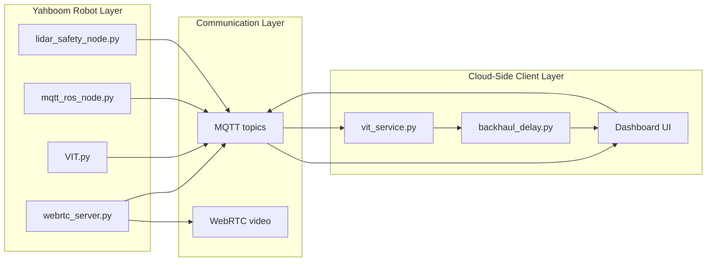

## Integrative Team Project - Final Report
Next-Gen Robotics: Real-Time Command and Control via 5G Edge
## AI

## Student Name

Group ID
## Supervisor Names

Submitted as part of the requirements for CEG1010 Integrative Team Project
CEG1010 Integrative Team Project  (2025-07)  Page 1

Declaration of Authorship

Name of candidate:
## Malcolm Liew Jia En
## Pyie Sone Khaing Min
## Muhammad Akid Iskandar Bin Zainudin
## Yeap Jia Hui
## Joseph Tang Zhi En
Student ID Number:
## 2502260
## 2502597
## 2501272
## 2501588
## 2501627
## Degree:
## Honours In Computer Engineering
## Project Title:
Next-Gen Robotics: Real-Time Command and Control via 5G Edge AI
## Academic Supervisors:
## Prof Ernest Tan Zheng Hui
## Cluster:

## Industry Supervisor:
(if applicable)

## Organization:
(if applicable)

We hereby confirm that:

- this work was done wholly or mainly while in candidature for a degree programme at SIT;

- where any part of this project has been previously submitted for a degree or any other
qualification at this University or any other institution, this has been clearly stated;

- We have acknowledged the use of all resources in the preparation of this report;

- the report contains / does not contain patentable or confidential information (strike through
whichever does not apply);

- the work was conducted in accordance with the research integrity policy and ethics standards
of SIT and that the research data are presented honestly and without prejudice. The SIT
Institutional Review Board (IRB) approval number is _________________________ (where
applicable);

- We have read and understood the University’s definition of plagiarism as stated in the SIT
## Academic Policies Scheme 14: Academic Integrity.

Plagiarism is the copying, using or passing off of another’s work as one’s own work
without giving credit to the author or originator, and also includes self-plagiarism. For
example, reusing, wholly or partially, one’s previous work in another context without
referencing its previous use.

____________________                                                                           ________________
CEG1010 Integrative Team Project  (2025-07)  Page 2

Signature of Student        Date
CEG1010 Integrative Team Project  (2025-07)  Page 3

Below are general topics your report should cover. It is NOT a table of contents, which
should be more detailed and specific to your project.

- Abstract (300 – 500 words)

## 2. Introduction
## 2.1 Background Info
Autonomous mobile robots are increasingly being used in applications such as manufacturing,
logistics, surveillance, healthcare and search-and-rescue. These applications require robots to sense
their surroundings, communicate with external systems, process information and respond to
commands in real time. Although modern robots can perform some processing locally, their onboard
computers are often constrained by limited processing power, memory, energy capacity and thermal
performance. These limitations become more significant when the robot must process continuous
camera data, execute artificial-intelligence models and perform navigation simultaneously.
Cloud robotics attempts to address this limitation by distributing computation between the robot
and more powerful remote computing resources. Computation offloading can reduce the processing
workload of the robot and allow more computationally demanding models to be used. However,
sending information to an external server introduces additional communication latency and makes
the robot dependent on the quality and availability of the network. Previous research therefore
emphasises that computation placement should consider factors such as network conditions,
processing time, accuracy and local computational cost rather than simply transferring all processing
to the cloud [1].
Recent Robot-to-Everything (R2X), research further describes robotic systems as an integration of
sensing, communication, computation and actuation. In such systems, lightweight and time-critical
operations should remain on the robot, while more computationally intensive perception and
decision-making tasks may be performed by a remote computing system [2]. Semantic feature
extraction can also reduce communication overhead by transmitting compact, task-relevant
representations instead of continuously transferring complete raw sensor data.
Another challenge arises when a robot repeatedly encounters the same object. Reprocessing or
retransmitting the same type of visual information for every observation can create unnecessary
delay and computational overhead. Caching previously generated visual representations provides a
possible solution by allowing the robot to reuse stored information when a familiar object is
observed again.
These concepts motivate the development of a practical robotic platform that supports real-time
remote control, local safety processing, cloud-assisted object recognition and cache-aware offloading
under different simulated communication-latency conditions.

## 1.2 Project Overview
This project, titled “Next-Gen Robotics: Real-Time Command and Control via Cache-Aware
Offloading,” develops a network-connected mobile robotic system using a Yahboom robot equipped
with a Raspberry Pi, camera and LiDAR sensor. The project combines robotic control, live video
communication, environmental sensing, artificial-intelligence-based visual recognition and
cache-aware offloading within a single integrated prototype.
CEG1010 Integrative Team Project  (2025-07)  Page 4

The system combines:
● remote command and control
● real-time video streaming
● LiDAR-based obstacle detection
● autonomous movement
● MobileCLIP-S1-based visual feature extraction
● cache-aware object recognition
● simulated cloud communication latency using configurable hops
● cloud-side recognition as a fallback after a cache miss
● automatic stopping when the target object is detected

The system follows a distributed architecture consisting of three main sections:
1) Robot-side processing: which manages physical movement, camera capture, LiDAR-based
obstacle detection, emergency stopping, autonomous movement and visual-feature
extraction.
2) Communication infrastructure: which transfers movement commands, robot status
information, cache-control messages, recognition information and live video between the
robot and the client.
3) Cloud-side client processing: which provides the user interface, displays live video and
sensor information, sends movement commands and represents the remote
cloud-processing component of the prototype.

On the robot, the Raspberry Pi manages camera capture, motor control, LiDAR sensing, local safety
functions and visual-feature extraction. Immediate operations such as obstacle detection and
emergency stopping remain on the robot so that they do not depend on a delayed remote response.

The client application provides a graphical interface through which the user can view the robot’s
status, observe its camera stream and send movement or operating commands. The client also
represents the cloud-processing component of the project. However, the system was not deployed
on an actual commercial cloud platform. Instead, configurable communication hops were added
when information was received by and transmitted from the client. These hops introduced controlled
delay to imitate the latency that may occur when a robot communicates with a remote cloud server.
This design was influenced by the RoboEC2 research, which studies how network conditions and
computation placement affect robotic offloading performance [1].

Robot commands and system messages are exchanged using the Message Queuing Telemetry
Transport protocol (MQTT). Robot movement is performed through ROS 2, while WebRTC is used to
provide a low-latency live camera stream to the client.

For visual recognition, the robot uses MobileCLIP-S1, a lightweight vision-language model designed
for efficient image and text representation. MobileCLIP-S1 uses a Vision Transformer-based image
encoder to extract meaningful visual features from the robot’s camera frames. These features are
converted into compact embedding vectors that represent the semantic content of each observation.

The target object used in the prototype is a black bottle. Multiple images of the bottle are collected
from different viewing angles and converted into reference embeddings. These embeddings are
stored in a local cache and later compared with live embeddings generated from the robot’s camera
feed using cosine similarity.

A cache-aware recognition mechanism is included to improve the efficiency of the visual-processing
CEG1010 Integrative Team Project  (2025-07)  Page 5

pipeline. When the similarity score between a live embedding and a stored bottle embedding
exceeds a configured threshold, the result is treated as a cache hit. The robot can then stop without
waiting for the delayed cloud-side recognition result.

If the cached comparison does not confidently identify the object, the result is treated as a cache
miss. In this case, the cloud-side recognition path remains available as a fallback. During testing,
there were cases where the cache did not recognise the bottle, but the cloud-side process
successfully detected it and returned a stop command after the simulated delay.

This approach explores how repeated recognition tasks can be completed with reduced dependence
on cloud processing while still retaining a remote fallback when the cache is insufficient.

The two recognition paths can be summarised as follows:

Cache-hit path: Camera frame → MobileCLIP-S1 embedding → local cache comparison → bottle
recognised → robot stops

Cache-miss path: Camera frame or embedding → simulated cloud communication hops →
cloud-side recognition → stop command returned → robot stops

This architecture reflects the broader principle of distributing computation according to task
requirements. Time-critical safety and cached recognition can be processed locally, while uncertain
or more demanding recognition tasks can continue through the cloud-side processing path [2].

## 2.3 Problem Statement
A major challenge in mobile robotics is achieving responsive and reliable operation while working
with limited onboard computing resources. A mobile robot may need to support live video
streaming, motor control, obstacle detection, autonomous movement and artificial-intelligence
inference at the same time.

Executing all these functions entirely on the Raspberry Pi may increase processing delay and reduce
the responsiveness of the robot. Conversely, transferring all recognition processing to a remote cloud
system can introduce communication delay and make the system dependent on network availability.

Continuous transmission of raw camera images can also consume significant bandwidth because
complete image frames are much larger than compact semantic feature vectors. Repeatedly
processing the same familiar object may create additional unnecessary computation when previously
extracted information could instead be reused.

The project therefore addresses the following central problem:

How can cache-aware offloading support real-time command and control, reduce unnecessary
dependence on delayed cloud processing and enable reliable target-object recognition on a
resource-constrained mobile robot?

Several technical issues arise from this problem. First, movement commands must reach the robot
with sufficiently low delay for responsive manual control. Second, the client must receive a live
CEG1010 Integrative Team Project  (2025-07)  Page 6

camera feed without excessive lag or interference with the AI perception pipeline. Third, visual
information must be processed efficiently because raw camera frames are significantly larger than
embedding vectors.

Fourth, the robot must remain safe even when client commands, AI inference or communication
experience delays. Therefore, obstacle detection and emergency stopping must be processed locally
and given priority over remote movement commands.

Fifth, cache-aware recognition must be reliable enough to detect the target bottle from different
angles and viewing conditions. If the cache fails to recognise the target, the system must still allow
the cloud-side processing path to detect the bottle and stop the robot.

This problem is important because communication-assisted robotics is not effective merely because
a robot is connected to an external computing system. The overall sensing-to-action loop must
remain sufficiently fast and dependable. A fully local design may overload the robot, while a fully
cloud-dependent design may respond too slowly when latency is high.

Cache-aware offloading provides a hybrid approach. A successful cache hit allows the robot to
respond without waiting for the cloud, while a cache miss allows the cloud-side recognition path to
continue as a fallback.

2.4 Project Aim and Objectives
The aim of this project is to design and implement a functional mobile robotic prototype that
demonstrates real-time command and control together with cache-aware offloading and
cloud-assisted object recognition.

The project objectives are to:
● develop a client interface for controlling and monitoring the Yahboom robot
● transmit movement and operating commands through MQTT
● integrate MQTT commands with ROS 2 robot motion
● provide a low-latency live camera stream through WebRTC
● use LiDAR sensing for local obstacle detection and emergency stopping
● support autonomous movement and obstacle avoidance
● extract compact visual embeddings using MobileCLIP-S1
● implement cache-aware recognition using stored embeddings of a black bottle
● compare live and stored embeddings using cosine similarity
● simulate cloud communication latency using configurable client-side hops
● use cloud-side recognition as a fallback when the local cache misses
● stop the robot automatically when the target object is recognised by either the cache or
cloud-processing path
● evaluate how different simulated latency conditions affect recognition and stopping
response time
● demonstrate the integration of sensing, communication, computation, caching and actuation
in a practical robotic application.

## 2.5 Project Scope
The scope of the project is centred on a single Yahboom mobile robot operating within a controlled
indoor environment. The robot supports manual movement, autonomous obstacle avoidance, live
video streaming and recognition of a predefined target object.

CEG1010 Integrative Team Project  (2025-07)  Page 7

The target object used in the project is a black bottle. The visual-recognition system uses multiple
reference images captured from different angles and converted into cached embeddings. The project
focuses on the use of a pretrained MobileCLIP-S1 model rather than training a new large-scale
artificial-intelligence model.

The cloud-processing environment is represented by the client application instead of an actual
commercial cloud platform. Configurable communication hops are used to simulate cloud latency
during the transmission and return of information. Therefore, the project evaluates the effect of
controlled communication delay rather than the full behaviour of a real cloud infrastructure.

The project does not attempt to implement a fully autonomous commercial robot, large-scale
multi-robot coordination. Instead, the system serves as a proof of concept for real-time robotic
command and control through cache-aware offloading. It demonstrates the core principles required
for future development, including local safety processing, remote command delivery, compact
semantic feature extraction, cached object recognition, simulated cloud latency, cloud-side fallback
processing and adaptive distribution of computational responsibilities.

## 3. Literature Research
‒ Summarize the relevant literature (articles, papers, books ...) concerned with the
background of the project, related work by others, and technical foundations.
‒ What you should strive for:
“Relevant academic and state-of-the-art research is described thoroughly and
extensively. Student demonstrates a clear understanding of the referenced literature.”
## 4. Problem Analysis, Technical Content and Application of Knowledge

### 4.1 Analysis of the Identified Problems

The technical problems analysed in this chapter were derived directly from the problem statement
presented in Section 2.3. The project was not concerned only with implementing isolated features
on the Yahboom robot. The central engineering challenge was to integrate robot control, live video
streaming, visual recognition, cloud-side processing, cache-aware offloading and safety reflexes
while operating within the finite compute, memory, thermal and I/O capacity of a Raspberry Pi.
Each subsystem—camera capture, WebRTC encoding, MobileCLIP inference, MQTT messaging, ROS 2
actuation and LiDAR monitoring—imposed concurrent demands that could not be treated as independent
optimisation problems without risking end-to-end mission failure.

The research papers provided the theoretical basis for identifying and prioritising these problems.
RoboEC2 describes the compute-and-power limitations of mobile robots and explains that cloud
offloading can reduce onboard processing demand when heavier neural-network stages are relocated
to remote infrastructure. However, the same work emphasises that offloading is not unconditionally
beneficial: increased communication latency under poor network conditions can negate the compute
savings and degrade closed-loop robotic performance [1]. The R2X survey further identifies payload
size, end-to-end latency, reliability and task success as system-level metrics when sensing,
communication and computation are distributed between a robot and remote resources [2]. Together,
these sources established that the prototype had to be evaluated as a distributed system rather
than as a collection of locally optimal components.

The following subsections analyse the principal problems addressed by the project and explain the
design rationale used to resolve each one. Detailed implementation of the individual components is
presented in Sections 4.2 through 4.11; Section 4.12 synthesises how engineering and technical
knowledge were applied across the integrated architecture.

## 4.1.1 Limited Onboard Computing Resources

The Yahboom robot used a Raspberry Pi as its main onboard computer. During operation, the
Raspberry Pi had to support several tasks simultaneously, including:
● capturing camera frames;
● streaming live video through WebRTC;
● generating MobileCLIP image embeddings;
● performing local cache comparisons;
● receiving and publishing MQTT messages;
● processing LiDAR scans;
● controlling movement through ROS 2; and
● executing autonomous movement logic.

Running all these functions concurrently increased processor utilisation, memory pressure and
scheduling delay. If the visual-recognition pipeline consumed disproportionate CPU time, other
time-sensitive functions—motor control at 20 Hz, continuous video transmission, MQTT command
handling and obstacle detection—could become less responsive. In embedded robotics, such
contention is not merely a performance inconvenience; it can translate directly into unsafe
actuation latency when stop commands compete with inference for processor cycles.

This corresponds to the compute-and-power-limited problem identified by RoboEC2. The paper
explains that resource-constrained mobile robots may not possess sufficient onboard computation or
power reserves to execute the most accurate deep-learning models efficiently. Cloud processing is
proposed as one way of reducing this local computational burden, provided that the communication
cost remains acceptable [1]. The MobileCLIP literature complements this view by demonstrating that
mobile-friendly vision-language encoders can reduce inference latency on edge devices without
abandoning pretrained semantic representations entirely [3].

The project addressed this problem through deliberate workload partitioning rather than hardware
upgrade. Yahboom performed the MobileCLIP image-encoding stage, while the client performed
text-label matching and softmax-based confidence scoring. MobileCLIP-S1 was selected because the
MobileCLIP family was specifically designed to reduce the size and latency of image-text models for
mobile deployment, offering an improved latency–accuracy trade-off through hybrid CNN–transformer
architectures [3]. Processing demand was further controlled by running inference only on selected
camera frames (every fifth frame), allowing configurable embedding dimensions (128/256/512),
separating live video transmission from embedding transmission, and retaining only time-critical
operations—LiDAR safety and ROS 2 velocity publication—on the robot.

Therefore, the solution did not rely on either fully local processing or fully remote processing.
Instead, it divided the workload according to the latency sensitivity and bandwidth cost of each
task. Section 4.4 describes the encoding pipeline; Section 4.5 describes the complementary
cloud-side decoding stage.

4.1.2 Cloud Communication Latency and Network Dependence

Transferring visual-recognition processing to the cloud reduces the computational workload on the
Raspberry Pi, but it introduces communication delay. In the normal cloud-recognition path, an
embedding must:
- be generated on the Yahboom;
- travel to the cloud-side client;
- be decoded and matched against the configured labels;
- produce a recognition result; and
- return through the control path before the robot can respond.

This creates a delay between the moment the camera observes the object and the moment the robot
receives the stop command. If the network is slow or unavailable, the robot may respond too late
or may not receive the result at all. For a mobile platform navigating toward a target, such delay
directly affects mission success because the robot may pass the bottle before a remote decision
arrives.

RoboEC2 identifies this as a major offloading trade-off. Although cloud processing reduces onboard
computation, network congestion can create latency that severely affects robotic performance. The
paper therefore evaluates offloading according to time, accuracy and computational cost rather than
assuming that cloud processing is always preferable [1].

The R2X survey expresses the same principle using an end-to-end timing condition. Communication-assisted
offloading is beneficial only when the combined uplink, remote-processing and downlink time is
shorter than the alternative local or waiting path [2]:

T_uplink + T_remote + T_downlink < T_alternative

The project investigated this issue by representing the client as the cloud-processing component and
inserting artificial delays at the client's receiving and sending stages through backhaul_delay.py.
These simulated hops allowed the team to test how increasing cloud latency affected the time required
to recognise the bottle and stop the robot, independent of functional correctness on a local LAN.
Section 4.8 formalises the gamma hop model and compares cloud-path latency with cache-hit latency.

Cache-aware offloading was introduced to reduce dependence on the delayed cloud path. When a local
cache hit occurred, the robot could respond without waiting for cloud decoding. When the cache missed,
the embedding continued through the cloud path, preserving recognition capability as a fallback.
This dual-path design reflects the R2X recommendation to combine local reflex decisions with remote
semantic processing [2].

4.1.3 Visual Data Paths and Reaction-Time Comparison

A second challenge was to measure and compare bottle-recognition reaction time under two operating
modes while the operator still received continuous visual feedback. The prototype therefore ran two
visual paths in parallel rather than replacing one with the other. WebRTC delivered a live camera
stream to the dashboard for monitoring and test observation. A separate recognition path used
MobileCLIP embeddings for either local cache comparison or cloud-side label matching, with
simulated backhaul hops on the client so cloud delay could be varied independently of the LAN.

The R2X survey describes semantic feature extraction as a way to preserve task-relevant information
with lower bandwidth than raw imagery, and recommends that immediate reactive actions remain on the
robot while more demanding processing may run remotely [2]. In this project, that guidance informed
how the recognition experiment was structured—not by eliminating video, but by using compact
embeddings on the offloading path so cache-aware stops could be compared fairly against cloud
round-trip delay. Transmitting a full JPEG to the client on every recognition attempt would have
inflated uplink traffic without improving the latency comparison the tests were designed to measure.

The camera server (webrtc_server.py) captures frames at 320×240 pixels and 15 frames per second.
Each frame is compressed as a JPEG at quality level 70. For onboard encoding, frames are wrapped in a
JSON envelope (frame_id, timestamp, base64 jpg_b64) and published locally on yahboom/camera/frame
for VIT.py. For operator viewing, the same capture path feeds WebRTC to the dashboard. A typical
MQTT JPEG payload is substantially larger than a float32 embedding vector.
Base64 expansion alone increases byte count by approximately one-third relative to binary encoding,
and JPEG payloads at this resolution routinely exceed tens of kilobytes per frame.

On the recognition offloading path, only MobileCLIP embeddings are sent to the client on
yahboom/vit/embedding—on cache miss or when cache-aware mode is off. The robot supports 512, 1024
and 2048-byte payloads (128, 256 and 512 dimensions). Even with JSON overhead, an embedding remains
orders of magnitude smaller than a full frame, which keeps the cloud path focused on semantic
offloading rather than raw-image relay.

The project therefore adopted a dual-stream visual strategy:

● WebRTC carries the continuous live video stream to the client dashboard for human monitoring
  during cache-aware and cloud-recognition tests.
● MQTT carries JPEG frames locally from webrtc_server.py to VIT.py for onboard encoding only.
● On cache miss—or when cache-aware mode is off—the compact embedding is published to the client
  for cloud-side label matching and reaction-time measurement against the local cache-hit path.

Both streams were active during testing so operators could observe the robot while timed comparisons
were recorded between cache-aware local stops and cloud-mediated stops under the same scene
conditions. Section 4.3 explains how exclusive camera ownership supports this arrangement without
opening the sensor twice.

4.1.4 Repeated Processing of Familiar Objects

The target used in the project was a black bottle. During repeated tests, the robot could encounter
the same target multiple times within a single mission. Without caching, every observation would be
processed through the normal cloud-recognition path even though semantic information representing
the bottle had already been generated and transmitted previously.

This created unnecessary repetition in:
● embedding transmission;
● cloud-side decoding;
● label matching; and
● return-command delay.

Each repetition consumed bandwidth, client CPU time and wall-clock delay without adding new
information to the decision. In a latency-sensitive stopping task, redundant cloud round-trips
directly degraded responsiveness when the robot re-encountered a familiar object from a previously
observed viewpoint.

The project addressed this problem by storing previously generated bottle embeddings in a local
cache on the Yahboom. During cache-aware operation, the live embedding was first compared against
these stored reference embeddings using cosine similarity on L2-normalised vectors. The decision rule
was:

Cache hit ⇒ handle locally
Cache miss ⇒ send embedding to cloud

A cache hit prevented the embedding from being transmitted to the cloud-side client. A cache miss
preserved the normal cloud-recognition path. The cache therefore did not replace cloud recognition
completely; it acted as an early decision layer that reused previously extracted semantic information
when the current observation was sufficiently similar to a stored representation. Sections 4.6 and
4.7 describe cache creation, multi-angle reference capture and the consecutive-hit logic that
prevents false stops.

4.1.5 Real-Time Command and Control Requirements

The robot had to respond promptly to manual commands, autonomous commands, safety conditions and
recognition results. A delay in one part of the system could affect the complete sensing-to-action
loop.

For example:
● movement commands had to reach the robot quickly enough for manual teleoperation;
● AI inference should not block ROS 2 movement publication;
● video streaming should not delay MQTT command handling;
● bottle recognition should stop autonomous movement correctly; and
● LiDAR safety should override other commands when an obstacle was detected.

The system therefore had to support concurrent processing rather than executing every function
sequentially on a single thread. Blocking inference inside the motor-control loop would violate the
20 Hz velocity publication requirement and could leave the robot coasting with stale non-zero
velocity if commands arrived sporadically.

The project addressed this by separating functions into independent components:
● MQTT carried lightweight robot commands;
● ROS 2 handled movement and sensor topics;
● WebRTC handled video;
● VIT.py handled image encoding and cache decisions;
● vit_service.py handled cloud-side decoding; and
● LiDAR safety remained local.

This modular structure allowed movement, video, recognition and safety processes to operate
independently while exchanging only the required messages. The movement node published ROS 2
velocity commands at a fixed rate instead of relying on isolated one-time commands, which helped
maintain consistent robot motion and ensured that stop commands could be applied through the same
movement-control path. Sections 4.9 and 4.10 detail the MQTT–ROS bridge and LiDAR priority scheme.

4.1.6 Recognition Reliability and Operational Safety

Reliable recognition was difficult because the bottle could appear differently depending on:
● viewing angle;
● distance from the camera;
● lighting conditions;
● background objects;
● partial visibility; and
● motion blur.

A cache created using only one image could recognise the bottle mainly when the live view closely
resembled that original reference. A similarity threshold that was too low could produce false
detections, while a threshold that was too high could create frequent cache misses and force
unnecessary cloud offloading.

The project addressed recognition reliability by:
● capturing six reference bottle embeddings from different viewpoints;
● comparing the live embedding against every cached sample;
● using the highest similarity score (best-match selection);
● applying a configured similarity threshold (default 0.70);
● requiring three consecutive cache hits before stopping; and
● using a detection latch to prevent repeated stop commands.

The cloud-side decoder remained available as a fallback. If the cache did not recognise the bottle,
the client could still compare the incoming image embedding with the bottle text label and stop the
robot through the normal cloud path at 75% dashboard confidence.

Operational safety created a separate problem. Visual recognition depended on camera processing, AI
inference and communication, all of which could experience delay. Obstacle avoidance therefore could
not depend entirely on cloud recognition. The R2X survey recommends retaining simple reflex actions
on the robot while offloading heavier processing to remote systems [2]. The project followed this
principle by keeping LiDAR-based obstacle detection and emergency stopping on the Yahboom. This
allowed the robot to stop locally even when cloud communication or visual recognition was delayed.
Hard estop in manual mode and soft stop in autonomous mode are described in Section 4.10.

4.1.7 Translating Research Problems into the Project Design

A further challenge was translating the broad concepts presented in the research papers into a
practical prototype suitable for a single Yahboom platform and a local laptop client.

RoboEC2 investigates dynamic DNN splitting and deployment using an actual Amazon EC2 environment.
The project did not reproduce the complete RoboEC2 platform or dynamically divide individual
neural-network layers at runtime. Instead, its main design principles were adapted:
● local and remote computation should be balanced according to task latency sensitivity;
● communication latency must be measured and simulated, not assumed negligible;
● payload size affects offloading performance and should be configurable; and
● the best processing location depends on the task (reflex vs semantic).

Similarly, the R2X survey describes a broad architecture involving sensing, communication and
computation across multi-robot systems. The project applied a focused subset of these concepts to
one Yahboom robot:
● camera and LiDAR for sensing;
● MQTT and WebRTC for communication;
● Raspberry Pi and client-side processing for computation; and
● motor stopping and autonomous movement for actuation.

The MobileCLIP paper provided the basis for selecting an efficient image-text model, but it did not
specify how cache-aware robotic stopping should be implemented. The team therefore combined insights
from all three research sources and developed a practical three-layer architecture documented in
Section 4.2.

The final design response can be summarised as follows:

| Problem | Design response | Primary component |
| --- | --- | --- |
| Limited onboard compute | Split encode (robot) / decode (client); inference on every 5th frame | VIT.py, vit_service.py |
| Cloud latency | Simulated gamma backhaul hops; cache hit bypasses cloud | backhaul_delay.py, VIT.py |
| Bandwidth / payload size | Dual-stream design: WebRTC monitoring plus embedding-based offloading for cache vs cloud reaction-time tests | VIT.py, webrtc_server.py |
| Repeated recognition | Multi-angle cache + cosine similarity | cache_embeddings.json, VIT.py |
| Real-time control | MQTT + ROS 2 at 20 Hz; WebRTC on separate path | mqtt_ros_node.py, webrtc_server.py |
| Recognition reliability | Six reference views, consecutive hits, cloud fallback | VIT.py, vit_service.py |
| Operational safety | Local LiDAR hard/soft stop independent of cloud | lidar_safety_node.py |

CEG1010 Integrative Team Project  (2025-07)  Page 12

## 4.2 Overall Conceptual Design

The prototype was structured as three cooperating layers: robot, communication and client. Each layer
owned a distinct responsibility, and data crossed layer boundaries only through named MQTT topics or
the WebRTC video channel.

### 4.2.1 Yahboom Robot Layer

The robot layer ran on the Raspberry Pi and included the camera, LiDAR, motor controller and ROS 2
runtime. Five scripts carried the onboard workload:

| Script | Main responsibility |
| --- | --- |
| webrtc_server.py | Camera capture, WebRTC streaming, JPEG frames to MQTT |
| VIT.py | MobileCLIP encoding, cache comparison, offloading decisions |
| capture_bottle_cache_multi.py | Six-angle reference embedding capture |
| mqtt_ros_node.py | MQTT-to-ROS motion bridge and autonomous navigation |
| lidar_safety_node.py | LiDAR monitoring and hard/soft stopping |

Safety reflexes, motor control and image encoding remained on the robot because they are
time-critical and because camera data was already local. Only text-label matching was delegated to
the client.

### 4.2.2 Communication Layer

Two protocols carried different traffic types. MQTT transported commands, embeddings, recognition
results, cache events and safety status. Primary topics were:

● yahboom/cmd — movement, estop, auto mode, cache-aware commands
● yahboom/camera/frame — JPEG frames for VIT.py
● yahboom/vit/embedding — embeddings on cache miss
● yahboom/vit/status — encoder status
● yahboom/vit/result — decoded recognition results
● yahboom/detect/status — local cache detection events
● yahboom/safety/status — LiDAR safety feedback

WebRTC carried the continuous live video stream. Keeping video off the MQTT bus prevented large
media payloads from competing with stop commands and compact embeddings.

### 4.2.3 Cloud-Side Client Layer

The laptop client stood in for a remote cloud server. The Yahboom Dashboard backend performed
decoding, display and command issuance, while backhaul_delay.py inserted configurable hop delays on
non-video MQTT traffic [1].

The client had four roles: operator interface, embedding reception, MobileCLIP label matching in
vit_service.py, and stop-command publication when the bottle was detected. Decoding meant
interpreting an image embedding against text embeddings from labels.json—not reconstructing the
original camera image [3]. WebRTC was excluded from hop delay so monitoring stayed responsive under
high simulated latency.

### 4.2.4 Normal Cloud-Recognition Workflow

When cache-aware mode was off, or when a cache miss occurred, recognition followed the cloud path:

1. webrtc_server.py publishes a JPEG frame on yahboom/camera/frame.
2. VIT.py decodes the frame and generates a MobileCLIP-S1 embedding.
3. VIT.py publishes the embedding on yahboom/vit/embedding.
4. The client receives the message after a simulated incoming hop.
5. vit_service.py matches the embedding against text labels.
6. The result is published on yahboom/vit/result after a simulated outgoing hop.
7. At ≥75% bottle confidence, the dashboard sends auto_off then stop on yahboom/cmd.
8. mqtt_ros_node.py publishes a zero-velocity ROS 2 Twist.

This is the full encode-offload-decode-actuate loop used whenever local cache does not handle
recognition.

### 4.2.5 Cache-Aware Offloading Workflow

When the client sends Cae_ON, VIT.py enables cache-aware mode:

1. A camera frame is encoded to a MobileCLIP embedding (same as the cloud path).
2. The live embedding is compared against all entries in cache_embeddings.json.
3. On cache hit (similarity ≥ threshold for the best match):
   ● the embedding is not sent to the client;
   ● after three consecutive hits, VIT.py publishes stop and auto_off; and
   ● an event is published on yahboom/detect/status.
4. On cache miss:
   ● the embedding follows the normal cloud path; and
   ● the dashboard may still stop the robot after remote decoding.

Cache-aware mode persists until Cae_OFF. A local stop does not disable caching; the operator must
explicitly end cache-aware operation.

CEG1010 Integrative Team Project  (2025-07)  Page 13

## 4.3 Camera Capture and Live Video Streaming

The camera subsystem supplied frames to both operator preview and MobileCLIP encoding through a
single capture process.

### 4.3.1 Camera Resource-Sharing Challenge

Live streaming and inference both needed the same physical camera. Opening the device from multiple
processes caused frame drops and access conflicts on the Raspberry Pi. Exclusive ownership was
assigned to webrtc_server.py; VIT.py consumed relayed frames on yahboom/camera/frame instead of
opening the sensor directly.

### 4.3.2 Camera Capture Using webrtc_server.py

The script opens camera index 0 at 320×240 and 15 FPS. A camera_worker thread reads frames under a
lock, JPEG-compresses them at quality 70, and publishes to yahboom/camera/frame. The same latest
frame buffer feeds WebRTC, so preview and inference share one capture path.

### 4.3.3 WebRTC Video Transmission

webrtc_server.py hosts an aiohttp server on port 8080. The browser negotiates WebRTC via SDP
offer/answer at /offer. CameraVideoTrack returns the latest shared frame to the WebRTC stack. This
path is independent of the MQTT embedding pipeline and was not subject to simulated backhaul delay.

### 4.3.4 Camera-Frame Delivery to VIT.py

VIT.py subscribes to yahboom/camera/frame, decodes jpg_b64 with OpenCV, and buffers BGR frames for
vit_worker. MobileCLIP runs on every fifth frame (INFERENCE_EVERY_N_FRAMES = 5), separating capture
rate from inference load and keeping encoding off the motor-control critical path.

## 4.4 Robot-Side MobileCLIP Image Encoding

VIT.py converted camera frames into compact embeddings for local cache lookup and optional cloud
offload.

### 4.4.1 Selection of MobileCLIP-S1

The project used MobileCLIP-S1 (datacompdr weights) via open_clip. Larger CLIP models exceed
Raspberry Pi memory and latency budgets. MobileCLIP-S1 pairs a hybrid MCi1 image encoder with a
compact text encoder, giving a practical latency–accuracy trade-off for on-device encoding [3].

### 4.4.2 Role of VIT.py

VIT.py is the robot-side perception hub. It encodes frames, compares against the bottle cache,
publishes embeddings on miss, issues local stops on hit, and handles runtime commands (embds1/2/3,
Cae_ON, Cae_OFF) on yahboom/cmd.

### 4.4.3 Image Preprocessing and Encoding

For camera frame X, the encoder produces:

e_I = f_I(X)

where f_I is the MobileCLIP-S1 image encoder. The pipeline is:

BGR → RGB → PIL → preprocessing → encode_image → L2 normalise → truncate → L2 normalise again

Inference runs every fifth frame to limit CPU use alongside WebRTC and ROS 2 workloads.

### 4.4.4 L2 Embedding Normalisation

Embeddings are scaled to unit length:

e = e / ||e||_2,  where  ||e||_2 = sqrt( Σ e_j² )

Normalisation makes dot products equivalent to cosine similarity and keeps cache thresholds stable
across sessions.

### 4.4.5 Configurable Embedding Dimensions

Truncation reduces MQTT payload size. Three settings are supported:

| Command | Payload size | Dimensions |
| --- | --- | --- |
| embds1 | 512 bytes | 128 |
| embds2 | 1024 bytes | 256 |
| embds3 | 2048 bytes | 512 |

Default is embds3 (512 dimensions). Vectors are re-normalised after truncation because slicing
changes magnitude.

### 4.4.6 Embedding Payload Construction

On cache miss, VIT.py publishes JSON on yahboom/vit/embedding containing raw_bytes,
embedding_dim, base64 float32 data, frame_id, timestamp, image_file_size, and cache metadata
(cache_hit, similarity, threshold). The image_file_size field links embedding traffic back to the
source frame cost.

CEG1010 Integrative Team Project  (2025-07)  Page 14

## 4.5 Cloud-Side MobileCLIP Decoding and Label Matching

vit_service.py completed zero-shot label matching on the client using the same MobileCLIP model
family as the robot encoder.

### 4.5.1 Role of vit_service.py

vit_service.py runs in the Dashboard backend. It subscribes to VIT MQTT topics, decodes embeddings,
maintains session history, and publishes results for the UI and stop-logic hooks.

### 4.5.2 MQTT Embedding Reception

On connect, the service subscribes to yahboom/vit/embedding. Each message passes through
backhaul_delay.apply() before parsing, simulating uplink latency from robot to cloud [1].

### 4.5.3 Embedding Parsing and Dimension Validation

Payloads may be JSON envelopes or legacy raw float32 bytes. Base64 data is decoded to a float32
vector; declared embedding_dim must match byte length (512, 1024 or 2048 bytes for 128, 256 or 512
dimensions). Mismatches raise validation errors rather than silent mis-decoding.

### 4.5.4 Label Configuration Using labels.json

Text labels load from labels.json for zero-shot classification. The label "bottle" is the mission stop
target. Labels are editable from the dashboard without changing robot code because decoding is
entirely client-side.

### 4.5.5 MobileCLIP Text-Embedding Generation

At startup, MobileClipDecoder tokenises all labels and runs encode_text. Text embeddings are
L2-normalised. For truncated image vectors, the matching prefix of each text embedding is sliced
and re-normalised so dimensions align during comparison.

### 4.5.6 Image-to-Text Similarity Matching

For normalised image embedding e_I and text embeddings {e_Ti}, label scores are:

s_i = e_I · e_T_i

With unit vectors, this equals cosine similarity. The highest-scoring label is the decoded class.

### 4.5.7 Softmax Confidence Calculation

Scores become confidence percentages via scaled softmax:

p_i = softmax(100 · s_i)

Results include top-k labels. A 60% decode threshold flags low confidence in published results; the
dashboard requires 75% on "bottle" before issuing a stop command.

### 4.5.8 Recognition-Result Publication

Decoded output on yahboom/vit/result includes top_label, top_confidence, ranked results,
embedding_size, embedding_dim and timestamp. An outgoing backhaul delay is applied before
publication.

### 4.5.9 Dashboard Stop-Command Handling

When bottle confidence reaches 75%, edgeAwareStopLabelEstop.ts sends auto_off then stop on
yahboom/cmd. This uses a soft stop (not estop_on), so the operator can resume without clearing a
hard emergency latch.

CEG1010 Integrative Team Project  (2025-07)  Page 15

## 4.6 Cache Creation and Reference-Embedding Storage

Reference embeddings were captured offline and stored for runtime cache comparison.

### 4.6.1 Limitations of a Single Reference Image

One cached vector represents a single pose, distance and lighting condition. During testing, a
single-image cache missed frequently when the live view differed in angle or occlusion, forcing
unnecessary cloud offloads.

### 4.6.2 Multi-Angle Bottle Data Collection

Six snapshots of the black bottle were taken at varied angles and distances—front, left, right,
slight rotation, near and far. Multiple references improved coverage of appearance variation without
retraining MobileCLIP.

### 4.6.3 Role of capture_bottle_cache_multi.py

This helper script listens to yahboom/vit/embedding while VIT.py runs. The operator repositioned the
bottle and pressed Enter after each stable view; the latest embedding was saved to
/home/pi/cache_embeddings.json with automatic backup of any existing file.

### 4.6.4 Cache-File Structure and Metadata

Each entry stores label ("bottle"), sample_id, model, pretrained, embedding_dim, threshold,
normalised flag, dtype, source frame, base64 float32 data and created_at. The file format is
{ "objects": [ ... ] }. VIT.py loads all "bottle" entries and normalises vectors at startup.

### 4.6.5 Similarity-Threshold Configuration

Each entry carries a similarity threshold (default 0.70). The best match across all samples must
exceed its threshold for a hit. Per-entry thresholds allow future multi-class extension; the
prototype used a single bottle label.

## 4.7 Cache-Aware Offloading Implementation

Cache logic in VIT.py decides whether to stop locally or forward an embedding to the client.

### 4.7.1 Cache Logic Integrated into VIT.py

On startup, VIT.py loads cache_embeddings.json and publishes on yahboom/cache_aware/ready. Comparisons
run only after Cae_ON; when cache-aware mode is off, every embedding is published normally.

### 4.7.2 Live-to-Cache Embedding Comparison

Each inferred frame produces a live embedding compared against every cached bottle vector when
cache_ready and test_active are both true.

### 4.7.3 Cosine-Similarity Calculation

With L2-normalised vectors:

similarity = e_live · e_cache

NumPy dot products implement this efficiently on the Pi for six reference samples per frame.

### 4.7.4 Best-Match Selection

The highest similarity across all cached samples determines the match, regardless of sample_id. This
supports recognition from any stored viewpoint during autonomous exploration.

### 4.7.5 Cache-Hit Decision

A hit occurs when similarity ≥ threshold for the best match. The embedding is not published to
yahboom/vit/embedding; terminal logs show confidence as similarity × 100%.

### 4.7.6 Cache-Miss and Cloud Fallback

On miss, VIT.py publishes the embedding with cache_hit=false plus similarity and threshold metadata.
Remote decoding can still identify the bottle and trigger a dashboard stop.

### 4.7.7 Consecutive-Hit Requirement

CONSECUTIVE_HITS_REQUIRED = 3 consecutive hits are needed before a stop command, filtering
single-frame similarity spikes.

### 4.7.8 Detection Latch and Cooldown

After a stop, a latch blocks repeat sequences until UNLATCH_MISSES_REQUIRED = 5 consecutive misses.
DETECTION_COOLDOWN_S = 2.0 s limits re-triggers. Stop is repeated STOP_REPEAT_COUNT = 8 times at
50 ms intervals for reliable MQTT delivery.

### 4.7.9 Persistent Cae_ON and Cae_OFF State

Only Cae_ON and Cae_OFF control cache-aware mode. stop and auto_off after detection do not disable
caching; the operator sends Cae_OFF to end a cache-aware session.

CEG1010 Integrative Team Project  (2025-07)  Page 16

## 4.8 Simulated Cloud Hops and Latency

backhaul_delay.py modelled wide-area latency because the client ran on a local laptop rather than
commercial cloud infrastructure [1][2].

### 4.8.1 Purpose of the Cloud Simulation

The simulation let the team test recognition responsiveness under configurable hop counts without
deploying to a remote cloud. It separated functional correctness on a LAN from the latency effects
that offloading introduces in practice.

### 4.8.2 Incoming Hop Delay

On receive, non-video MQTT messages pass through backhaul_delay.apply(), which samples a
gamma-distributed sleep modelling robot-to-cloud uplink latency.

### 4.8.3 Cloud-Side Decoding Time

After the incoming hop, vit_service.py runs MobileCLIP text matching. T_decode depends on client
hardware and embedding dimension and adds to—but is not part of—the hop model.

### 4.8.4 Outgoing Hop Delay

Before publishing yahboom/vit/result or sending stop commands, a second sampled hop models
cloud-to-robot downlink delay.

### 4.8.5 End-to-End Cloud-Latency Formula

T_cloud ≈ T_in + T_decode + T_out + T_cmd

Each hop delay uses:

shape = floor( (1 + 1.28 · M_BS / M_GW) · k1 + (h − 1) · k2 )

scale = a + packet_size_bits · k3

T_hop ~ Gamma(shape, scale) × 1000 ms

Defaults: h = 30, M_BS = 5, M_GW = 1, k1 = 1, k2 = 2, k3 = 1×10⁻⁸, a = 1×10⁻⁵,
packet_size_bits = 12000.

### 4.8.6 Local Cache Response-Time Formula

T_cache ≈ T_encode + T_compare + T_stop

No remote hops appear in this path.

### 4.8.7 Latency Saved by a Cache Hit

T_saved ≈ T_in + T_decode + T_out + T_cmd

Savings grow with hop count h because each additional hop increases the gamma shape parameter.

### 4.8.8 Low- and High-Latency Dry Runs

Low-hop settings verified functional correctness with near-immediate cloud decodes. High-hop settings
showed cache hits stopping the robot before cloud results returned.

### 4.8.9 Cloud Detection Following a Cache Miss

When local cache failed, embeddings still reached vit_service.py and cloud decoding could stop the
robot after the full round trip. The cache is therefore an optimisation layer, not a single point of
failure.

## 4.9 MQTT and ROS 2 Command and Control

mqtt_ros_node.py bridges dashboard and VIT commands into ROS 2 motor actuation.

### 4.9.1 Role of mqtt_ros_node.py

The node subscribes to yahboom/cmd, tracks movement and auto-mode state, and publishes
geometry_msgs/Twist on cmd_vel. It is the sole translator from MQTT text commands to motor targets.

### 4.9.2 MQTT Command Reception

Commands arrive as plain text or JSON on yahboom/cmd: movement (fwd, left, right, stop, etc.), servo
motion, auto_on/auto_off, estop_on/estop_off and auto_soft_stop. VIT.py listens separately for
embds and Cae commands to avoid handler conflicts.

### 4.9.3 Conversion to ROS 2 Twist Messages

Movement commands set target linear and angular velocities published as Twist messages on cmd_vel
for the Yahboom motor driver.

### 4.9.4 Linear and Angular Velocity Control

Manual mode targets LINEAR_SPEED = 0.5 m/s and ANGULAR_SPEED = 1.0 rad/s. Autonomous mode uses
lower forward speeds and separate turn gains. Servo commands adjust camera aim independently of base
motion.

### 4.9.5 Command Publication Rate

Velocity is published at PUBLISH_RATE = 20 Hz so intermittent MQTT delivery does not leave the
robot coasting with a stale non-zero velocity.

### 4.9.6 Velocity Ramping

LINEAR_STEP = 0.02 and ANGULAR_STEP = 0.05 per cycle ramp current speeds toward targets, reducing
wheel slip during direction changes.

### 4.9.7 Stop-Command Processing

stop zeros velocities immediately. estop_on latches estop_active and blocks movement until estop_off.
auto_soft_stop halts without latching—used for autonomous explore and bottle-detection stops.

CEG1010 Integrative Team Project  (2025-07)  Page 17

## 4.10 Autonomous Movement and LiDAR Safety

Local LiDAR processing provides obstacle reflexes independent of cloud recognition delay [2].

### 4.10.1 LiDAR Scan Processing

lidar_safety_node.py subscribes to LaserScan on /scan and derives front, side and rear distances.
Invalid readings outside sensor limits are discarded before any decision.

### 4.10.2 Sector-Based Distance Measurement

The front safety cone spans ±20°. mqtt_ros_node.py uses additional sectors (front-left, front-right,
side, rear) for autonomous gap finding.

### 4.10.3 Obstacle Detection

An obstacle is confirmed when CONFIRM_POINTS = 8 valid front readings fall below block distance.
WARNING_DISTANCE = 0.60 m triggers advisory status; BLOCK_DISTANCE = 0.35 m triggers stopping.

### 4.10.4 Gap-Width Estimation

In auto mode, candidate turn angles from −100° to +100° (4° steps) are scored by clearance. Paths
narrower than MIN_GAP_WIDTH_M = 0.195 m are rejected.

### 4.10.5 Direction Selection and Recovery

Clear front → forward motion scaled by clearance. Blocked front → steer to best gap, turn in place,
or left/right recovery. Both front and rear blocked → stop with auto_all_blocked_front_and_rear.

### 4.10.6 Local Hard Emergency Stop

In manual mode, a confirmed front obstacle publishes estop_on and stop. mqtt_ros_node.py latches
estop_active until estop_off; a 30-second re-arm grace period follows release.

### 4.10.7 Autonomous Soft Stop

In auto mode, the same obstacle triggers auto_soft_stop instead of estop_on. Bottle-detection stops
use the same non-latching pattern.

### 4.10.8 Safety and Command Priority

Priority (highest to lowest):

1. LiDAR hard e-stop (manual mode obstacle)
2. Estop latch
3. Soft stop (LiDAR auto mode or bottle detection)
4. Autonomous movement
5. Manual movement

Local safety always overrides delayed visual-recognition results.

## 4.11 System Integration Challenges and Solutions

Field integration exposed issues that isolated component tests did not reveal.

### 4.11.1 Video Stuttering and Processing Load

Concurrent WebRTC, MQTT JPEG publishing and MobileCLIP inference caused occasional stutter.
Mitigation: inference every fifth frame and separate threads/processes for video and VIT workloads.

### 4.11.3 Embedding-Dimension Mismatch

Robot and client mismatched embedding sizes caused decode failures. The embds1/embds2/embds3
commands and matching EMBEDDING_BYTES_TO_DIMS tables on both sides keep payload size aligned.

### 4.11.4 Weak Single-View Cache Recognition

A single cached image missed at unfamiliar angles. Six-angle capture via
capture_bottle_cache_multi.py improved hit rate.

### 4.11.5 One-Frame False Detection

Transient similarity spikes could trigger premature stops. CONSECUTIVE_HITS_REQUIRED = 3 required
stable detections.

### 4.11.6 Repeated Stop Commands

Without latching, every post-stop cache hit re-flooded MQTT with stop and auto_off. The detection
latch, cooldown and bounded repeat publish (8× at 50 ms) prevented spam while ensuring delivery.

### 4.11.7 Cache-Aware State Resetting

Cae_OFF resets test_active, hit streaks and the detection latch. The dashboard test bench clears
stop state at the start of each new run.

### 4.11.8 Invalid Cache Configuration File

Missing or empty cache_embeddings.json sets cache_ready=false and raises a load error rather than
silently disabling cache-aware mode.

### 4.11.9 Autonomous and Safety Command Conflict

Bottle detection sends auto_off and stop while LiDAR may send auto_soft_stop concurrently.
Separating soft stop from estop_on lets recognition and obstacle halts coexist without a manual
estop reset.

## 4.12 Application of Engineering Knowledge and Technical Learning

This section synthesises how engineering and technical knowledge were applied across the prototype.
Implementation detail appears in Sections 4.2–4.11; here the focus is on the underlying principles
and design patterns that tied the subsystems together.

### 4.12.1 Embedded-Systems Knowledge

The project applied resource-bounded design on a Raspberry Pi: single-camera ownership,
inference decimation, and modular processes for video, VIT encoding, motion control and LiDAR
safety. Rather than treating the platform as a single program that could run every workload on
every cycle, the team separated concerns into independent executables with narrow interfaces.
webrtc_server.py held exclusive access to the physical camera and published frames through a
shared buffer protected by a thread lock, so WebRTC encoding and MQTT JPEG relay did not compete
for duplicate V4L2 handles. VIT.py consumed those frames asynchronously and ran MobileCLIP only on
every fifth capture (INFERENCE_EVERY_N_FRAMES = 5), decoupling continuous sensing from bursty neural
inference. mqtt_ros_node.py and lidar_safety_node.py ran alongside perception as ROS 2 nodes with
their own callback and timer loops, including 20 Hz cmd_vel publication so motor commands did not
depend on sporadic MQTT arrivals.

This partitioning addressed three embedded constraints simultaneously: CPU contention, I/O
contention and timing predictability. Video compression and WebRTC encoding could proceed in
parallel with inference because they no longer blocked inside the same process loop. LiDAR safety
and velocity ramping remained on deterministic periodic timers rather than behind inference queues.
MQTT command handling stayed lightweight relative to model execution, preserving a path for stop
commands even when encoding was active.

The outcome was a workable concurrent workload without hardware upgrade—demonstrating that
scheduling, process boundaries and workload placement matter as much as raw compute when
integrating live streaming, on-device inference and real-time motor control on a resource-limited
robot computer.

### 4.12.2 Artificial-Intelligence Knowledge

Rather than training a new model, the team deployed a pretrained vision-language encoder (MobileCLIP-S1)
as a feature extractor and partitioned the pipeline: image encoding on the robot, text matching on
the client [3]. Transfer learning, inference budgeting, embedding truncation as a bandwidth knob,
threshold-based decisions and hybrid local/remote inference were applied at the systems level rather
than through custom model training.

### 4.12.3 Linear Algebra and Similarity Measurement

Recognition relied on comparing L2-normalised embedding vectors. Cosine similarity reduced to dot
products after normalisation (similarity = e_live · e_cache), connecting cache logic directly to
unit-vector geometry and inner-product similarity. The same principle underpinned client-side
image-to-text matching. Temporal filters (consecutive hits, detection latch) added a time dimension
to geometric decisions, reducing false stops from outlier frames.

### 4.12.4 Computer-Networking Knowledge

Traffic was segregated by purpose: MQTT for control and semantic features, WebRTC for continuous
video. Topic naming under yahboom/ gave a stable contract between robot and client. QoS choices
reflected priority—confirmed delivery where needed, fire-and-forget for high-rate frames. The gamma
backhaul model applied networking concepts (multi-hop delay, right-skewed latency distributions) to
make local testing representative of wide-area conditions [1][2].

### 4.12.5 Cloud and Distributed-Computing Knowledge

The laptop client functioned as a logical remote compute node. Task placement followed latency
sensitivity: reflexes and encoding stayed on the robot; label matching moved to the client. The R2X
timing inequality (uplink + remote + downlink vs local alternative) was evaluated experimentally by
varying hop count and comparing cloud-path delay against cache-hit response [2]. This illustrated
distributed placement, payload design and fallback paths without requiring a commercial cloud
deployment.

### 4.12.6 Cache-System Knowledge

The bottle cache was content-addressable storage in embedding space: live vectors mapped to stored
reference vectors rather than filenames or URLs. Design choices mirrored general caching practice—
reference diversity (six views), threshold tuning, early-exit before remote lookup, and policy
(Cae_ON/Cae_OFF) separated from individual hit/miss outcomes. The cache optimised the recognition
path without replacing cloud decoding entirely.

### 4.12.7 ROS 2 and Robotics Knowledge

ROS 2 provided typed publish/subscribe middleware for onboard sensing and actuation. mqtt_ros_node.py
and lidar_safety_node.py consumed LaserScan on /scan and published Twist on /cmd_vel—the standard
pattern for differential-drive platforms. Perception (VIT.py) and video (webrtc_server.py) used MQTT
and WebRTC instead, showing how ROS can scope to locomotion and geometric sensing while higher-level
services use other transports.

Key robotics patterns applied included: (1) an MQTT–ROS bridge that converts event-based remote
commands into a 20 Hz velocity stream, because differential drives need continuous Twist publication;
(2) asynchronous sensor callbacks updating internal state, with a fixed-rate controller mapping state
to actuators; (3) velocity ramping to limit jerk; (4) a closed safety loop where lidar_safety_node.py
publishes estop_on or auto_soft_stop back to yahboom/cmd, reusing the same actuation path as operator
and recognition stops; and (5) explicit state machines for manual, auto and latched estop modes. These
patterns align with the literature recommendation to keep reflex actions local while offloading
heavier deliberation remotely [2].

### 4.12.8 System Integration and Trade-Off Analysis

No single setting maximised accuracy, latency, bandwidth, safety and usability simultaneously. Higher
embedding dimension and inference rate improved recognition but loaded the Pi and MQTT. Lower
resolution stabilised video but reduced visual detail. Aggressive cache thresholds cut cloud traffic
but increased misses on unseen views. High hop counts highlighted cache value while slowing cloud
fallback.

The final design is a documented compromise: local LiDAR safety, semantic features instead of raw
video offload, cache-aware early exit, simulated backhaul for observable latency, and cloud decoding
as fallback. Quantitative evaluation under varying hop settings is reported in Section 6.

## 6. Testing, Evaluation and Outlook

This section presents the testing methodology, experimental results, team collaboration summary
and future work for the cache-aware offloading prototype. Detailed quantitative evaluation of
recognition response time, cache hit rate and stop latency under varying backhaul hop settings
complements the architectural analysis in Section 4.

### 6.1 Testing Methodology

*(To be completed: describe bench tests, dry runs at low/high hop counts, cache-aware vs cloud-only
paths, LiDAR safety tests, and dashboard integration checks.)*

### 6.2 Results and Analysis

*(To be completed: present measured end-to-end latencies, cache hit/miss behaviour, bottle stop
success rate, and comparison of T_cache vs T_cloud using the formulas in Section 4.8.)*

### 6.3 Team Collaboration

*(To be completed: describe roles, integration milestones, and how subsystems were developed
and merged.)*

### 6.4 Future Work and Outlook

*(To be completed: real 5G/cloud deployment, dynamic layer splitting, multi-object cache, improved
autonomous navigation, and production hardening.)*

CEG1010 Integrative Team Project  (2025-07)  Page 23

## 7. References
[1] B. Liu, L. Wang and M. Liu, “RoboEC2: A Novel Cloud Robotic System With Dynamic Network
Offloading Assisted by Amazon EC2,” IEEE Transactions on Automation Science and Engineering, vol.
21, no. 4, pp. 4959–4973, Oct. 2024.

[2] H. J. Yang et al., “Advancing Multi-Robot Networks via MLLM-Driven Sensing, Communication, and
Computation: A Comprehensive Survey,” IEEE Communications Surveys & Tutorials, vol. 28, 2026.

[3] P. K. A. Vasu, H. Pouransari, F. Faghri, R. Vemulapalli and O. Tuzel, “MobileCLIP: Fast Image-Text
Models through Multi-Modal Reinforced Training,” in Proceedings of the IEEE/CVF Conference on
CEG1010 Integrative Team Project  (2025-07)  Page 23

Computer Vision and Pattern Recognition (CVPR), 2024, pp. 15963–15974.

CEG1010 Integrative Team Project  (2025-07)  Page 24
