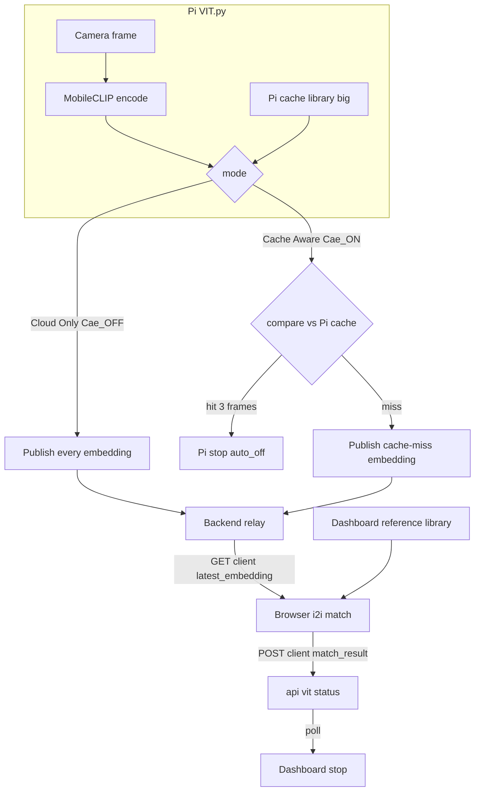
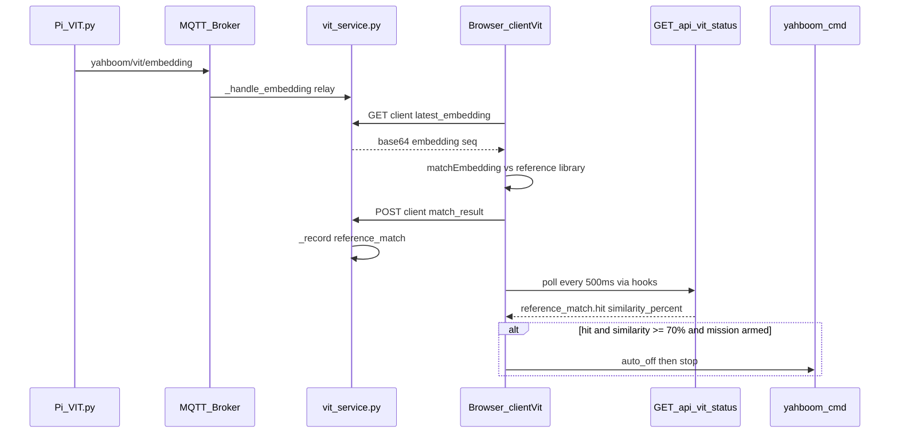

# Cloud Image-to-Image Reference Matching

This document explains how the dashboard stops on **your specific water bottle** using image-to-image embedding similarity (not CLIP text labels).

## 1. The problem

You want the robot to stop when it sees **your specific water bottle**, not just any bottle-shaped object.

There are three recognition approaches in this project:

| Approach | Question it answers | Specificity |
|----------|---------------------|-------------|
| **Text labels** (`labels.json` + CLIP) | "Does this look like the word *bottle*?" | Low — any bottle-like object |
| **Pi cache** (`cache_embeddings.json` on Pi) | "Does this vector match my stored bottle vectors?" | High — your exact bottle |
| **Dashboard reference** (`reference_embeddings.json`) | Same math as Pi cache, but matching runs in the **browser** | High — your exact bottle |

Cloud reference matching lets the test bench stop on your exact bottle using Pi-generated embeddings matched client-side against the dashboard reference library.

## 1a. Two detection modes (current architecture — client i2i)

Detection is **image-to-image only**. The **client never encodes images** — it receives **image embeddings generated on the Pi** (relayed by the backend) and matches them in the browser against the dashboard reference library. The test bench exposes a mutually exclusive toggle:

| Mode | What the Pi sends | Pi cache (`/home/pi/cache_embeddings.json`) | Client i2i match | Pi `Cae_*` | Who stops |
|------|-------------------|-----------------------------------------------|------------------|-----------|-----------|
| **Cloud Only** | **Every** embedding | Not consulted (`Cae_OFF`) | Browser vs dashboard reference | `Cae_OFF` | Dashboard on i2i hit |
| **Cache Aware Offloading** | **Cache-miss** embeddings only | Consulted first; hits stop on Pi | Browser vs dashboard reference on miss | `Cae_ON` | Pi on cache **hit**; dashboard on cache **miss** + i2i hit |

Neither mode uses CLIP text-label softmax for stop. Display and stop are **image-to-image reference similarity only**.

### Two separate libraries

| Library | Location | Used for |
|---------|----------|----------|
| **Pi cache** | `/home/pi/cache_embeddings.json` (large DB) | On-Pi cache check only (Cache Aware mode). Hits are handled entirely on the Pi — the embedding is **not** sent to the dashboard. |
| **Dashboard reference** | `backend/app/services/vit/reference_embeddings.json` | Browser image-to-image match against Pi embeddings the Pi chose to publish. |



Code:

- **Pi embedding relay:** `VITService._store_client_embedding()` in [`vit_service.py`](../backend/app/services/vit/vit_service.py) — backend relays MQTT embeddings to `GET /api/vit/client/latest_embedding`.
- **Client i2i:** [`src/lib/clientVit/referenceStore.ts`](../src/lib/clientVit/referenceStore.ts), [`referenceMatch.ts`](../src/lib/clientVit/referenceMatch.ts), [`useClientReferenceDetection.ts`](../src/lib/useClientReferenceDetection.ts).
- **Stop:** [`cloudAwareStopLabelEstop.ts`](../src/lib/cloudAwareStopLabelEstop.ts) (`processVitStatusForStopLabelEstop`) polling `/api/vit/status` (populated by `POST /api/vit/client/match_result`).

No MobileCLIP model runs on the dashboard host for detection. Optional backend text-label decode (`VIT_ENABLE_MODEL`, off by default) is display-only and unrelated to stop.

## 2. What is an embedding?

An **embedding** is a fixed-length vector that MobileCLIP extracts from a camera frame on the **Pi**. Similar-looking images produce similar vectors.

```
Camera frame  →  VIT.py (MobileCLIP-S1)  →  float32 vector (128 / 256 / 512 dims)
                                              e.g. [0.02, -0.11, 0.34, ...]
```

- Default on the Pi: **512 dimensions** = **2048 bytes** (`embds3`)
- Smaller sizes: 256 dims (1024 B), 128 dims (512 B)

The dashboard never converts images to embeddings. It receives only the vector on MQTT topic `yahboom/vit/embedding` (relayed to the browser).

## 3. Image-to-image vs text-to-image

### Text decoding (optional, off by default)

```
Live embedding  →  compare to text prompts ("bottle", "cup", …)  →  softmax confidence %
```

Implemented in `MobileClipDecoder` in `vit_service.py` when `VIT_ENABLE_MODEL=true`. **Cloud stop does not use this path.**

### Reference matching (Cloud stop)

```
Pi embedding  →  compare to dashboard reference vectors (in browser)  →  cosine similarity
```

Implemented in `src/lib/clientVit/referenceMatch.ts`. Matching uses plain JavaScript float math (no torch, no ONNX).

You "register" your bottle by **saving its embedding vectors** at capture time. At runtime, each Pi embedding is scored against those references in the browser.

## 4. End-to-end data flow



### Steps

1. **Pi** runs `VIT.py` + camera. Every N frames, MobileCLIP publishes an embedding on `yahboom/vit/embedding` (every frame in Cloud Only; cache-miss only in Cache Aware).
2. **Dashboard backend** (`vit_service.py`) relays each embedding to `GET /api/vit/client/latest_embedding` (dedupe on `seq`).
3. **Browser** (`useClientReferenceDetection`) polls ~180 ms, decodes the base64 float32 blob, and runs image-to-image match against `GET /api/vit/reference/active`.
4. **Browser** POSTs the match to `/api/vit/client/match_result` so `/api/vit/status`, the widget, and CSV stay populated.
5. **Browser** (`useCloudAwareStopLabelEstop`) polls `/api/vit/status` every 500 ms. On a new decode after START with `hit` and similarity ≥ 70%, sends `auto_off` + `stop`.

## 5. Matching math

Same logic as Pi `check_detection()` in `Yahboom Car/Used/VIT.py` and the former backend `ReferenceEmbeddingStore`:

1. L2-normalize live and reference vectors
2. Dot product = cosine similarity
3. Best match = highest similarity across all samples (same `embedding_dim` only)
4. Hit = similarity ≥ effective threshold

```
similarity = dot(live_normalized, reference_normalized)
hit = similarity >= effective_threshold
```

### Effective threshold

```javascript
effective_threshold = max(sample_threshold, stop_threshold)  // stop_threshold default 0.70
hit = similarity >= effective_threshold
```

The client also requires `similarity_percent >= 70` in `src/lib/cloudAwareStopLabelEstop.ts`.

## 6. Reference file format

**Default path:** `backend/app/services/vit/reference_embeddings.json`

Same schema as Pi `/home/pi/cache_embeddings.json` from `Yahboom Car/Used/capture_bottle_cache_multi.py`. See `reference_embeddings.json.example` in the same directory.

| Field | Purpose |
|-------|---------|
| `label` | Must match `VIT_REFERENCE_LABEL` (default `target bottle`) |
| `sample_id` | Angle/view index (1–6 from multi-angle capture) |
| `data` | Base64 float32 embedding bytes |
| `embedding_dim` | Must match live size (512 for default `embds3`) |
| `threshold` | Per-sample minimum (client uses `max(threshold, 0.70)`) |

## 7. Creating the reference file

### Option A — Dashboard capture (recommended)

Use the **Reference Capture** panel in the VIT Scene Decoder widget:

1. Start `VIT.py` + camera on the Pi (`Cae_OFF` for Cloud Only so every embedding is relayed).
2. Enter a **category** slug (e.g. `target_bottle`).
3. Point the Pi camera at your bottle and click **Capture** — the dashboard saves the **latest Pi MQTT embedding** relayed by the backend.
4. Move the bottle to a different angle and click **Capture** again.
5. Click **Activate** to copy that category into `reference_embeddings.json` and reload client matching.

Folder layout:

```
Dashboard: backend/app/services/vit/reference_library/
             target_bottle/512/cache_embeddings.json
             target_bottle/1024/cache_embeddings.json
             target_bottle/2048/cache_embeddings.json

Active:    backend/app/services/vit/reference_embeddings.json  (copy-on-activate)
```

Each embedding size (512 / 1024 / 2048 bytes) is stored separately under the category. **Activate** or change the **Embedding Size** slider to switch which size is used for matching — no need to recapture if you already have references at that size.

API endpoints:

| Route | Purpose |
|-------|---------|
| `POST /api/vit/reference/capture` | Save latest relayed Pi embedding |
| `POST /api/vit/reference/activate` | Activate a category for client matching |
| `GET /api/vit/reference/categories` | List categories and snapshot counts |
| `GET /api/vit/reference/status` | Library status and last capture |

No SSH required for reference capture.

### Option B — Manual Pi capture

1. Start `VIT.py` on the Pi.
2. Run `capture_bottle_cache_multi.py` on the Pi.
3. Capture **your** bottle at six angles; press Enter after each stable view.
4. Copy `/home/pi/cache_embeddings.json` to `backend/app/services/vit/reference_embeddings.json`.
5. Restart the Flask backend (`npm run dev:backend`) and reload the dashboard.

Multi-angle capture improves recognition when the bottle appears at different poses during autonomous driving.

## 8. What runs where

| Component | Location | Role |
|-----------|----------|------|
| Camera + encoder | Pi (`VIT.py`) | Produces live embeddings |
| Pi cache check | Pi (`VIT.py`, Cache Aware only) | Stops on cache hit; suppresses embedding publish |
| Reference file | Dashboard disk | Stores bottle vectors for client match |
| Embedding relay | `vit_service.py` | Relays Pi MQTT embeddings to browser |
| i2i match | Browser (`clientVit/`) | Image-to-image match vs reference library |
| `MobileClipDecoder` | `vit_service.py` | Optional text labels (`VIT_ENABLE_MODEL`, off) |
| Stop command | Browser | `auto_off` + `stop` on `yahboom/cmd` |

### Cloud Only: use `Cae_OFF`

In Cloud Only mode the Pi must publish **every** embedding. With `Cae_ON`, cache hits suppress MQTT publish — use **`Cae_OFF`** for Cloud Only.

### Cache Aware: what a cache hit looks like

When `Cae_ON` and the live embedding matches the Pi cache (`similarity >= threshold` for 3 consecutive frames):

1. The Pi sends `stop` + `auto_off` locally (no embedding forwarded to dashboard).
2. The Pi publishes `yahboom/detect/status` for the test bench.
3. The browser **never** sees that embedding — no client i2i runs.
4. The dashboard skips re-sending `auto_off` when the Pi already stopped (`skipAutoOffAfterBenchRun`).

On a **cache miss**, the Pi publishes the embedding to `yahboom/vit/embedding`; the browser matches it against the dashboard reference library.

## 9. Configuration

Environment variables in `backend/config.py`:

| Variable | Default | Meaning |
|----------|---------|---------|
| `VIT_REFERENCE_EMBEDDINGS_FILE` | `vit/reference_embeddings.json` | Reference JSON path |
| `VIT_REFERENCE_LABEL` | `target bottle` | Label filter |
| `VIT_REFERENCE_MATCH_ENABLED` | `true` | Reference store enabled (status/activate) |
| `VIT_REFERENCE_DEFAULT_THRESHOLD` | `0.70` | Default per-entry threshold |
| `CLOUD_AWARE_REFERENCE_THRESHOLD` | `0.70` | Floor for client `hit` |
| `PI_REFERENCE_CAPTURE_SCRIPT_PATH` | _(removed)_ | Reference capture uses relayed MQTT embeddings — no SSH |
| `PI_REFERENCE_LIBRARY_DIR` | _(removed)_ | Library lives on dashboard only |
| `VIT_REFERENCE_LIBRARY_DIR` | `vit/reference_library/` | Category folders on dashboard |
| `VIT_ENABLE_MODEL` | `false` | Optional backend text-label decode (off) |
| `VIT_CLIENT_DETECTION_MODE` | `cloud_aware` | Default mode mirrored to `vit_service` |

Client: `CLOUD_AWARE_MIN_CONFIDENCE = 70` in `cloudAwareStopLabelEstop.ts`.

## 10. API

`GET /api/vit/status` key fields:

- `reference_ready`, `reference_count`, `reference_file`, `reference_error`
- `reference_active_category`, `reference_snapshot_count`
- `detection_mode`: `"cloud_aware"` or `"cache_aware_offloading"`
- `reference_stop_threshold`: floor similarity (0-1) for a stop
- `latest.match_mode`: `"reference_embedding"`; `latest.reference_match`: `{ label, sample_id, similarity, similarity_percent, threshold, hit }`; `latest.source`: `"client_match"`

Endpoints:

| Endpoint | Purpose |
|----------|---------|
| `GET /api/vit/client/latest_embedding` | Latest Pi embedding relayed to browser (dedupe on `seq`) |
| `GET /api/vit/reference/active` | Active reference vectors for browser i2i |
| `POST /api/vit/client/match_result` | Record match the browser computed (telemetry) |

If no reference category is active, the widget shows a hint and stop will not fire.

## 11. Stop trigger

All must be true:

1. Cloud-aware stop enabled
2. Test-bench session armed (after START)
3. Cloud test-bench mode active
4. New decode (timestamp not already handled)
5. `reference_match.hit === true`
6. `similarity_percent >= 70`
7. Outside 5 s cooldown
8. E-stop not latched

Pre-START detections are ignored.

## 12. UI

The **Stop Test Bench** widget has a mutually exclusive **Detection Mode** control: **Cloud Only** (`Cae_OFF`) vs **Cache Aware Offloading** (`Cae_ON`).

The **VIT Scene Decoder** widget (`Widgets.tsx`) shows the client image-to-image match: similarity %, sample id, reference count, and a mode pill (`CLOUD — CLIENT MATCH` / `CACHE AWARE — CLIENT MATCH`). The **Reference Capture** panel saves the latest relayed Pi embedding into categorized folders on the dashboard host (embeddings only — no preview JPEGs).

## 13. Pi cache vs dashboard reference

| | Pi cache (`Cae_ON`) | Dashboard reference (browser) |
|--|---------------------|-------------------------------|
| Matching runs on | Pi | Browser |
| Reference file | `/home/pi/cache_embeddings.json` (big DB) | `reference_embeddings.json` |
| Who sends stop | Pi (on cache hit) | Dashboard (on client i2i hit) |
| MQTT bandwidth | Lower (hits not published) | Every forwarded embedding |
| Test bench mode | Cache Aware | Both modes use client match for forwarded embeddings |

## 14. Troubleshooting

| Symptom | Likely cause | Fix |
|---------|--------------|-----|
| `reference_ready: false` | Missing file or category not activated | Capture snapshots and click Activate |
| Low similarity | Wrong bottle, angles, or dim mismatch | Re-capture; use `embds3` (512 dims) |
| No Pi embeddings in Cloud Only | `Cae_ON` suppressing publish | `Cae_OFF` for Cloud Only |
| Cache Aware: Pi stops but dashboard idle | Cache hit — expected | Pi handled stop; no embedding forwarded |
| Never stops | Not armed or pre-START decode | Press START; check `hit` and ≥ 70% |
| False stops | Threshold too low | Raise thresholds in env or JSON |
| Misses bottle | Threshold too high | More samples; lower threshold slightly |

## 15. Validating embeddings

Because both the Pi encoder and the dashboard reference capture use the same `MobileCLIP-S1 / datacompdr` pipeline on the Pi, embeddings captured via `capture_reference_snapshot.py` and live embeddings from `VIT.py` are directly comparable.

To validate:

1. Capture a static scene on the Pi and **Activate** the category.
2. Point the camera at the same scene in Cloud Only mode (`Cae_OFF`).
3. Read `latest.reference_match.similarity_percent` from `/api/vit/status`.
4. Expect **cosine similarity ≈ 0.95+** for the same frame. Large gaps usually mean different angles, lighting, or embedding dimension mismatch.

Cache Aware matches the Pi's own embedding bytes directly — ground truth for the reference math.

## 16. Summary

**The Pi generates image embeddings. The browser matches them against your dashboard reference library. If similarity is high enough after START, the dashboard stops the robot. The client never converts images to embeddings.**

Text labels ask *"is this a bottle?"* Reference matching asks *"is this my bottle?"*
