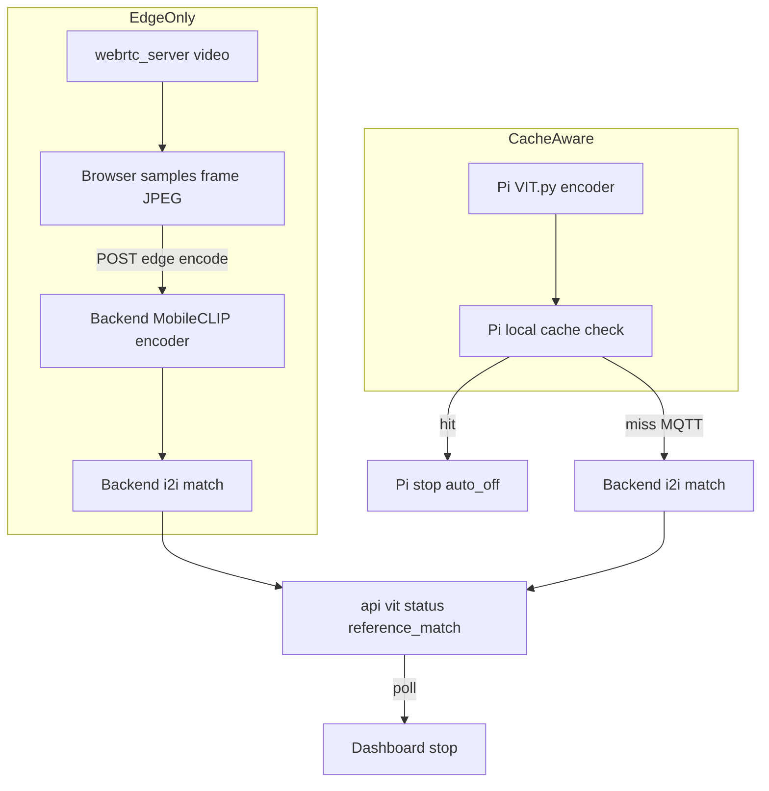
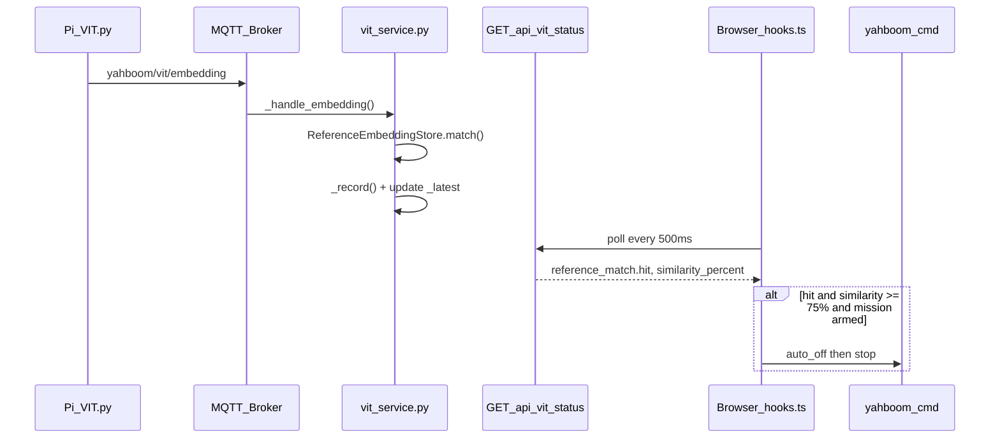

# Edge Image-to-Image Reference Matching

This document explains how the dashboard stops on **your specific water bottle** using image-to-image embedding similarity (not CLIP text labels).

## 1. The problem

You want the robot to stop when it sees **your specific water bottle**, not just any bottle-shaped object.

There are three recognition approaches in this project:

| Approach | Question it answers | Specificity |
|----------|---------------------|-------------|
| **Text labels** (`labels.json` + CLIP) | "Does this look like the word *bottle*?" | Low — any bottle-like object |
| **Pi cache** (`cache_embeddings.json` on Pi) | "Does this vector match my stored bottle vectors?" | High — your exact bottle |
| **Edge reference** (`reference_embeddings.json` on dashboard) | Same math as Pi cache, but matching runs on the **dashboard** | High — your exact bottle |

Edge reference matching lets **Edge test-bench mode** stop on your exact bottle without the Pi cache script or generic text labels.

## 1a. Two detection modes (current architecture — backend encoding)

Detection is **image-to-image** and all MobileCLIP encoding + matching runs on the **backend**. The backend no longer text-decodes for the UI (`VIT_ENABLE_MODEL` defaults to `false`). The test bench exposes a mutually exclusive toggle:

| Mode | Embedding source | Matching (i2i) | Pi `Cae_*` | Who stops |
|------|------------------|----------------|-----------|-----------|
| **Edge Only** | Browser forwards **WebRTC frames**; **backend** encodes with MobileCLIP (`open_clip`) | **Backend** vs reference library | `Cae_OFF` | Dashboard on i2i hit |
| **Cache Aware Offloading** | **Pi MQTT** embedding (already computed on Pi) | **Backend** vs reference library | `Cae_ON` | Pi on cache **hit**; dashboard on cache **miss** + i2i hit |

Neither mode uses CLIP text-label softmax. Display and stop are **image-to-image reference similarity only**.



Code:

- **Edge Only frame forward:** [`src/lib/useEdgeFrameEncoder.ts`](../src/lib/useEdgeFrameEncoder.ts) samples the WebRTC `<video>` and POSTs a JPEG to `POST /api/vit/edge/encode`.
- **Backend encode + match:** `MobileClipDecoder.encode_image()` and `VITService.encode_frame_and_match()` in [`vit_service.py`](../backend/app/services/vit/vit_service.py); Cache Aware matches MQTT embeddings in `_handle_embedding()`.
- **Stop:** [`edgeAwareStopLabelEstop.ts`](../src/lib/edgeAwareStopLabelEstop.ts) (`processVitStatusForStopLabelEstop`) polling `/api/vit/status`.

### Backend encoder requirements

Edge Only backend encoding needs **`torch` + `open_clip_torch` + `Pillow`** on the dashboard host (in `requirements.txt`). The model loads once in a background thread; if the deps are missing, Edge Only is disabled and the widget shows "Backend encoder unavailable" (Cache Aware still works). No model ships to the browser.

## 2. What is an embedding?

An **embedding** is a fixed-length vector that MobileCLIP extracts from a camera frame. Similar-looking images produce similar vectors.

```
Camera frame  →  VIT.py (MobileCLIP-S1)  →  float32 vector (128 / 256 / 512 dims)
                                              e.g. [0.02, -0.11, 0.34, ...]
```

- Default on the Pi: **512 dimensions** = **2048 bytes** (`embds3`)
- Smaller sizes: 256 dims (1024 B), 128 dims (512 B)

The dashboard never sees the raw image for matching — only the vector on MQTT topic `yahboom/vit/embedding`.

## 3. Image-to-image vs text-to-image

### Text decoding (display only for Edge stop)

```
Live embedding  →  compare to text prompts ("bottle", "cup", …)  →  softmax confidence %
```

Implemented in `backend/app/services/vit/vit_service.py` (`MobileClipDecoder`). Zero-shot classification — no photo of your bottle is stored. **Edge stop does not use this path.**

### Reference matching (Edge stop)

```
Live embedding  →  compare to stored bottle vectors  →  cosine similarity
```

Implemented in `ReferenceEmbeddingStore` in the same file. Matching uses NumPy only (no torch required).

You "register" your bottle by **saving its embedding vectors** at capture time. At runtime, each live vector is scored against those references.

## 4. End-to-end data flow



### Steps

1. **Pi** runs `VIT.py` + camera. Every N frames, MobileCLIP publishes an embedding on `yahboom/vit/embedding`.
2. **Dashboard** (`vit_service.py`) subscribes and runs `_handle_embedding()` per message.
3. **Reference matching** normalizes the live vector, compares to all stored samples, picks the best similarity, sets `hit` if above threshold.
4. **`GET /api/vit/status`** exposes `latest.reference_match`.
5. **Browser** (`useEdgeAwareStopLabelEstop` in `src/app/hooks.ts`) polls every 500 ms. On a new decode after START with `hit` and similarity ≥ 75%, sends `auto_off` + `stop`.

## 5. Matching math

Same logic as Pi `check_detection()` in `Yahboom Car/Used/VIT.py`:

1. L2-normalize live and reference vectors
2. Dot product = cosine similarity
3. Best match = highest similarity across all samples
4. Hit = similarity ≥ effective threshold

```
similarity = dot(live_normalized, reference_normalized)
hit = similarity >= effective_threshold
```

### Effective threshold

```python
threshold = float(best_match["threshold"])              # per JSON entry, default 0.70
effective_threshold = max(threshold, stop_threshold)  # stop_threshold default 0.75
hit = best_similarity >= effective_threshold
```

The client also requires `similarity_percent >= 75` in `src/lib/edgeAwareStopLabelEstop.ts`.

## 6. Reference file format

**Default path:** `backend/app/services/vit/reference_embeddings.json`

Same schema as Pi `/home/pi/cache_embeddings.json` from `Yahboom Car/Used/capture_bottle_cache_multi.py`. See `reference_embeddings.json.example` in the same directory.

| Field | Purpose |
|-------|---------|
| `label` | Must match `VIT_REFERENCE_LABEL` (default `bottle`) |
| `sample_id` | Angle/view index (1–6 from multi-angle capture) |
| `data` | Base64 float32 embedding bytes |
| `embedding_dim` | Must match live size (512 for default `embds3`) |
| `threshold` | Per-sample minimum (backend uses `max(threshold, 0.75)`) |

## 7. Creating the reference file

### Option A — Dashboard capture (recommended)

Use the **Reference Capture** panel in the VIT Scene Decoder widget:

1. Start `VIT.py` + camera on the Pi (`webrtc_server.py` or equivalent).
2. Ensure **`Cae_OFF`** so embeddings publish to `yahboom/vit/embedding`.
3. Enter a **category** slug (e.g. `black_bottle`) — one folder per object or bottle type.
4. Point the Pi camera at your bottle and click **Capture** — the dashboard SSHs to the Pi, runs `capture_reference_snapshot.py`, waits for one live embedding, appends it to the category folder on the Pi, then SFTP-syncs it to the dashboard.
5. Move the bottle to a different angle and click **Capture** again (one click = one snapshot).
6. Click **Activate** to copy that category into `reference_embeddings.json` and reload matching.

Folder layout:

```
Pi:        /home/pi/reference_library/
             black_bottle/cache_embeddings.json
             red_bottle/cache_embeddings.json

Dashboard: backend/app/services/vit/reference_library/
             black_bottle/cache_embeddings.json   (SFTP mirror)
             red_bottle/cache_embeddings.json

Active:    backend/app/services/vit/reference_embeddings.json  (copy-on-activate)
```

API endpoints:

| Route | Purpose |
|-------|---------|
| `POST /api/vit/reference/capture` | SSH capture one snapshot + SFTP sync |
| `POST /api/vit/reference/activate` | Activate a category for edge matching |
| `GET /api/vit/reference/categories` | List categories and snapshot counts |
| `GET /api/vit/reference/status` | Library status and last capture |

Requires `PI_SSH_USER` / `PI_SSH_PASSWORD` (or `PI_SSH_KEY_PATH`) in `.env`.

### Option B — Manual Pi capture

1. Start `VIT.py` on the Pi.
2. Run `capture_bottle_cache_multi.py` on the Pi.
3. Capture **your** bottle at six angles; press Enter after each stable view.
4. Copy `/home/pi/cache_embeddings.json` to `backend/app/services/vit/reference_embeddings.json`.
5. Restart the Flask backend (`npm run dev:backend`).

Multi-angle capture improves recognition when the bottle appears at different poses during autonomous driving.

## 8. What runs where

| Component | Location | Role |
|-----------|----------|------|
| Camera + encoder | Pi (`VIT.py`) | Produces live embeddings |
| Reference file | Dashboard disk | Stores bottle vectors |
| `ReferenceEmbeddingStore` | `vit_service.py` | Image-to-image match |
| `MobileClipDecoder` | `vit_service.py` | Text labels (display only) |
| Stop command | Browser | `auto_off` + `stop` on `yahboom/cmd` |

### Keep `Cae_OFF` on the Pi in Edge mode

When Pi cache-aware is **ON** (`Cae_ON`), a cache hit **suppresses** publishing to `yahboom/vit/embedding`. The dashboard must receive every embedding for edge matching — use **`Cae_OFF`**.

## 9. Configuration

Environment variables in `backend/config.py`:

| Variable | Default | Meaning |
|----------|---------|---------|
| `VIT_REFERENCE_EMBEDDINGS_FILE` | `vit/reference_embeddings.json` | Reference JSON path |
| `VIT_REFERENCE_LABEL` | `bottle` | Label filter |
| `VIT_REFERENCE_MATCH_ENABLED` | `true` | Enable matching |
| `VIT_REFERENCE_DEFAULT_THRESHOLD` | `0.70` | Default per-entry threshold |
| `EDGE_AWARE_REFERENCE_THRESHOLD` | `0.75` | Floor for backend `hit` |
| `PI_REFERENCE_CAPTURE_SCRIPT_PATH` | `~/Yahboom Car/Used/capture_reference_snapshot.py` | Pi capture script |
| `PI_REFERENCE_LIBRARY_DIR` | `~/reference_library` | Category folders on Pi |
| `VIT_REFERENCE_LIBRARY_DIR` | `vit/reference_library/` | Mirrored folders on dashboard |
| `PI_REFERENCE_CAPTURE_WAIT_SEC` | `10` | Seconds to wait for embedding on Pi |
| `VIT_ENABLE_MODEL` | `false` | Backend text-label decode (off — detection is i2i) |
| `VIT_ENABLE_EDGE_ENCODER` | `true` | Backend MobileCLIP image encoder for Edge Only frames |
| `VIT_CLIENT_DETECTION_MODE` | `edge_aware` | Default mode mirrored to `vit_service` |
| `VIT_CLIENT_EDGE_FPS` / `VITE_CLIENT_EDGE_FPS` | `5` | Browser frame-forward rate for Edge Only |

Client: `EDGE_AWARE_MIN_CONFIDENCE = 75` in `edgeAwareStopLabelEstop.ts`.

## 10. API

`GET /api/vit/status` key fields:

- `reference_ready`, `reference_count`, `reference_file`, `reference_error`
- `reference_active_category`, `reference_snapshot_count`
- `detection_mode`: `"edge_aware"` or `"cache_aware_offloading"`
- `edge_encoder_ready`: backend MobileCLIP image encoder loaded
- `reference_stop_threshold`: floor similarity (0-1) for a stop
- `latest.match_mode`: `"reference_embedding"`; `latest.reference_match`: `{ label, sample_id, similarity, similarity_percent, threshold, hit }`; `latest.source`: `"edge_frame"` or `"embedding"`

Endpoints:

| Endpoint | Purpose |
|----------|---------|
| `POST /api/vit/edge/encode` | Edge Only: upload a WebRTC frame (JPEG) for backend encode + match |

If no reference category is active, the widget shows a hint and stop will not fire.

## 11. Stop trigger

All must be true:

1. Edge-aware stop enabled
2. Test-bench session armed (after START)
3. Edge test-bench mode active
4. New decode (timestamp not already handled)
5. `reference_match.hit === true`
6. `similarity_percent >= 75`
7. Outside 5 s cooldown
8. E-stop not latched

Pre-START detections are ignored.

## 12. UI

The **Stop Test Bench** widget has a mutually exclusive **Detection Mode** control: **Edge Only** (`Cae_OFF`) vs **Cache Aware Offloading** (`Cae_ON`).

The **VIT Scene Decoder** widget (`Widgets.tsx`) shows the backend image-to-image match: similarity %, sample id, reference count, and a mode pill (`EDGE — BACKEND ENCODING` / `EDGE — WAITING VIDEO` / `EDGE — BACKEND ENCODER OFF` for Edge Only; `CACHE AWARE — PI EMBEDDINGS` for Cache Aware). The **Reference Capture** panel SSH-captures snapshots into categorized folders and activates a category for matching.

## 13. Pi cache vs edge reference

| | Pi cache (`Cae_ON`) | Edge reference |
|--|---------------------|----------------|
| Matching runs on | Pi | Dashboard |
| Reference file | `/home/pi/cache_embeddings.json` | `reference_embeddings.json` |
| Who sends stop | Pi | Dashboard browser |
| MQTT bandwidth | Lower (hits not published) | Every embedding sent |
| Test bench mode | Cache / Hybrid | Edge |

## 14. Troubleshooting

| Symptom | Likely cause | Fix |
|---------|--------------|-----|
| `reference_ready: false` | Missing file or category not activated | Capture snapshots and click Activate |
| Low similarity | Wrong bottle, angles, or dim mismatch | Re-capture; use `embds3` (512 dims) |
| No dashboard embeddings | Pi cache blocking | `Cae_OFF` |
| Never stops | Not armed or pre-START decode | Press START; check `hit` and ≥ 75% |
| False stops | Threshold too low | Raise thresholds in env or JSON |
| Misses bottle | Threshold too high | More samples; lower threshold slightly |

## 15. Validating backend vs Pi embeddings

Edge Only encodes frames on the **backend** (dashboard host), while references are captured on the **Pi**. Both use the same `open_clip` `MobileCLIP-S1 / datacompdr` pipeline — `MobileClipDecoder.encode_image()` mirrors `VIT.py get_embedding()` (RGB → `preprocess()` → `encode_image` → L2-normalize → truncate to the reference dim → re-normalize) — so they land in the same embedding space. Remaining drift is usually JPEG re-compression from the browser upload.

To validate:

1. Capture a static scene on the Pi (`capture_reference_snapshot.py`) and activate it.
2. Point the camera at the same scene in Edge Only mode and read `latest.reference_match.similarity_percent` from `/api/vit/status`.
3. Expect **cosine similarity ≈ 0.95+** for the same frame. Large gaps usually mean a different `open_clip` version/weights on the dashboard host vs the Pi, or an overly low browser JPEG quality (raise `JPEG_QUALITY` in `useEdgeFrameEncoder.ts`).

Cache Aware matches the Pi's own embedding bytes directly, so it is the ground truth for the reference math; use it to sanity-check the reference library independently of backend encoding.

## 16. Summary

**You capture your bottle as vectors, store them on the dashboard, and each live frame is scored against them on the backend. If similarity is high enough after START, the dashboard stops the robot.**

Text labels ask *"is this a bottle?"* Reference matching asks *"is this my bottle?"*
